### attach_shelf

An RB1 robot in a simulated warehouse world moves forward, turns, detects a shelf, moves underneath it and attaches to it by raising its elevator.

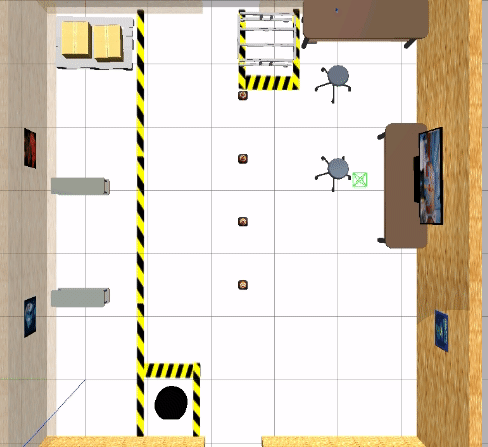  

#### Submission notes

##### 1. Task 1 - Pre-approach

1. Launching
   ```
   cd ~/ros2_ws/src
   git clone https://github.com/ivogeorg/attach_shelf.git
   cd ~/ros2_ws
   colcon build --packages-select attach_shelf
   source install/setup.bash
   ros2 launch attach_shelf pre_approach.launch.xml obstacle:=0.39 degrees:=-92.0
   ```
2. Note that the values for the arguments do not need to have such precision as the noise in the robot movement defeats them most of the time. It is not possible to achieve perfect alignment of the robot and the shelf/crate so that the robot can move underneath it by only going forward. The `/approach_shelf` is more likely to achieve sufficient accuracy by using a `TransformListener` and issue corrective `Twist` messages to the robot as it approaches.
3. Expected result
   | Gazebo | Rviz2 |
   | --- | --- |
   | 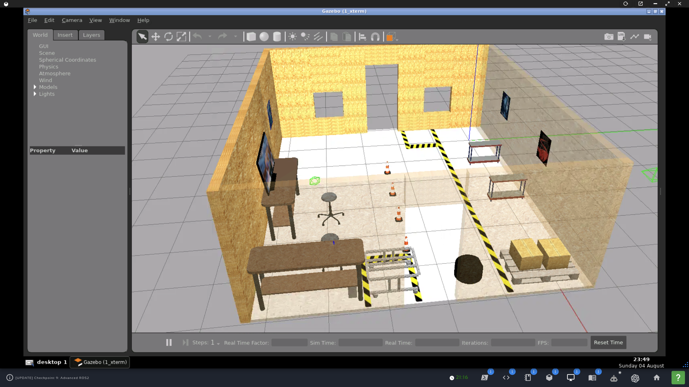 | 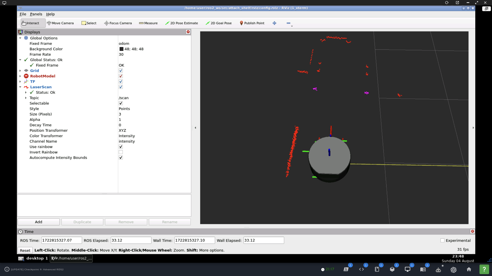 |

##### 2. Task 2 - Final approach


**TODO**  


#### Implementation notes*

_*Cumulative for both Task 1 and Task 2._  

##### 1. Put robot back in initial state in Gazebo w/o restart

_Optional_  

1. Can use the `/demo/set_entity_state` service to put the robot in the initial position for repeated testing.  
2. The service is of type `gazebo_msgs/srv/SetEntityState`.
3. The service server is provided by node `/demo/gazebo_ros_state`.  
4. Probably need to use `/demo/get_entity_state` to get the initial state.  

##### 2. ROS2 objects

1. Subscriber to `/scan` (`sensor_msgs/msg/LaserScan`).
2. Subscriber to `/odom` (`nav_msgs/msg/Odometry`).
3. Publisher to `/diffbot_base_controller/cmd_vel_unstamped` (`geometry_msgs/msg/Twist`).
4. Timer for velocity publisher.
5. Server for service `/approach_shelf` (custom `GoToLanding.srv`).
6. Client to service `/approach_shelf` (custom `GoToLanding.srv`).  
7. Publisher to `/elevator_up` (`std_msgs/msg/Empty`).  
8. Publisher to `/elevator_down` (`std_msgs/msg/Empty`).  
9. Transform listener.

##### 3. Adding a frame

Need to add a frame in the middle of the reflective plates of the shelf.  

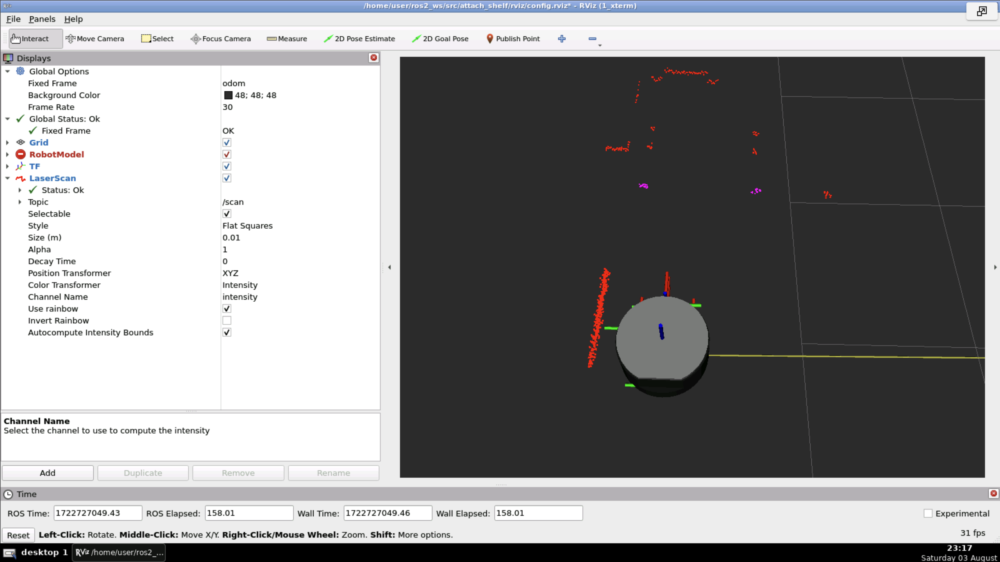  

1. General approach:
   1. Use the `intensities` array of the `sensor_msgs/msg/LaserScan` to identify the points of incidence on the two reflective plates. The intensities should be significantly higher for them than for other points.
   2. There should be two clusters. Use the `ranges` to get their centers. Then find the midpoint between them.
   3. Use this point to add a frame `cart_frame` to the tree. Tutorial for [adding a frame](https://docs.ros.org/en/humble/Tutorials/Intermediate/Tf2/Adding-A-Frame-Cpp.html).  
2. Algorithmic details:
   1. The origin frame of the scanner is `robot_front_laser_base_link`. Using the angle of a ray and its measured range to a point can yield the point's frame.
   2. The frames of the high-intesity points can be used for 3D k-means clustering, which will yield 1 or 2 clusters and the cluster centroids (with frames).
   3. From two points in 3D space, the midpoint between them can be found. The frame `cart_frame` can be computed and arranged so that it represents a meaningful motion goal for the robot.
   4. Using a transform between `robot_front_laser_base_link` and `cart_frame`, send `Twist` messages to the robot to move toward `cart_frame`.
   5. Move the robot forward for 30 more cm. This can be done with another frame or with `Odomerty` data.
3. The goal is:
   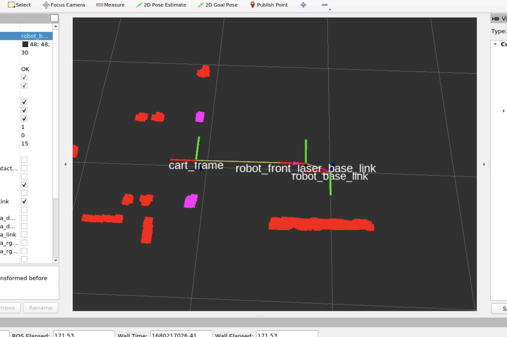   
4. The `cart_frame` has to be relative to the root of the world, in this case `odom`, otherwise it will move with the robot.  
5. The world coordinates of `cart_fram` can be calculated by "adding" a transform from a known transform, say, between `odom` and `robot_front_laser_base_link`, while the robot is stopped. Here is the latter TF:
   ```
   At time 1277.200000000
   - Translation: [5.777, -0.147, 0.235]
   - Rotation: in Quaternion [-0.699, 0.715, -0.000, -0.000]
   - Rotation: in RPY (radian) [-3.142, -0.000, -1.592]
   - Rotation: in RPY (degree) [-180.000, -0.000, -91.230]
   - Matrix:
    -0.021 -1.000 -0.000  5.777
    -1.000  0.021 -0.000 -0.147
     0.000 -0.000 -1.000  0.235
     0.000  0.000  0.000  1.000
   ```  
6. `cart_frame` will only have an `x` and a `y` component (and possibly a yaw) relative to `robot_front_laser_base_link`. So, these are two transforms, which need to be combined, by matrix multiplication (except we don't have a matrix for the latter) or some other way. _How to combine?_

| Gazebo | Rviz2 |
| --- | --- |
| 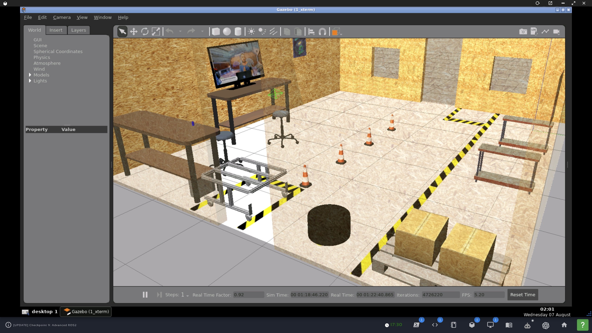 | 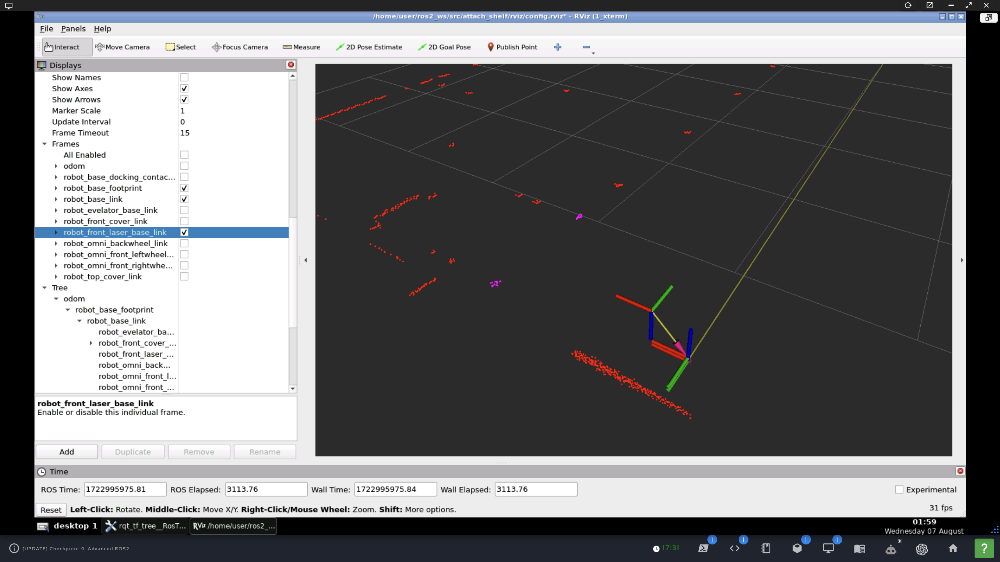 |   

###### 3.1. Brainstorming

Briefly, after the RB1 robot has completed the pre-approach, has faced the crate/shelf, and has identified the two reflective plates, this TF needs to be added right in between the reflective plates. Questions:
1. In the image showing the new TF in Rviz2, `cart_frame` seems to be defined relative to `robot_front_laser_base_link`. The arrow points from `cart_frame` to `robot_front_laser_base_link`. If the robot moves, won't `cart_frame` also move?
2. If we use a `TransformBroadcaster` instead of a `StaticTransformBroadcaster` to define `cart_frame` relative to `robot_front_laser_base_link`, won't it still move to maintain the definition relative to `robot_front_laser_base_link`?
3. Shouldn't `cart_frame`, which we need to stay in place to be used for moving the robot toward it, be defined in a transform from `odom` (or whatever the root link in the TF tree is)?
4. If `cart_frame` will move with `robot_front_laser_base_link`, do we have to recalculate the point and modify the TF broadcast? That seems to be counterintuitive, not to mention difficult, because the reflective plates will disappear from "laser view" as the robot approaches the crate/shelf.

###### 3.2 Brainstorming

1. `cart_frame` should be defined as a TF relative to `odom`.
2. Solve the SAS triangle. Get:
   1. The `x` and `y` coordinates of `cart_frame` relative to `robot_front_laser_base_link`.
   2. Get the angle of `cart_frame` from `robot_front_laser_base_link`.
3. Use a `TransformBroadcaster` to publish `cart_frame` relative to `robot_front_laser_base_link` once.
4. Use `tf_buffer.lookupTransform` between `odom` and `cart_frame`.
5. Use a `StaticTransformBroadcaster` to publish the TF between `odom` and `cart_frame`. By default, this is published once. 
6. Proceed with the final approach.

###### 3.3 Final strategy

**Note:** All in code. No hardcoding!  

1. Solve the SAS triangle to get the `x` and `y` offsets between `robot_front_laser_base_link` and `cart_frame`. Call them `x_offset` and `y_offset`. These offsets are _relative_ to the `robot_front_laser_base_link` frame. This frame is rotated, so the positive `x` axis points forward and the positive `y` points -90 deg to the right. For completeness, the positive `z` axis points down. Therefore:
   1. The `x_offset` is always positive.
   2. The sign of the `y_offset` depends on the relative length of the ranges to the (innermost points of the) reflective plates. Note that the names `left_range` and `right_range` are correct due to the scanner rotating CW. 
      1. If `left_range > right_range`, `y_offset` is _negative_.
      2. If `left_range < right_range`, `y_offset` is _positive_.
      3. For completeness, if `left_range == right_range`, `y_offset` is _zero (0.0)_. This is unlikely considering the precision of the ranges.
2. Declare private `std::string source_frame_` and `std::string target_frame_`. They will serve as parameters for the `tf_buffer_.lookupTransform()`. Will require some `bool` vars to enforce the logic.
3. Declare private `geometry_msgs::msg::TransformStamped odom_laser_t_`. It will hold the transform `odom` to `robot_front_laser_base_link` whic, when the robot has completed the pre-approach, will be used to define the tranform `odom_cart_` from `odom` to `cart_frame` by adding the offsets `x_offset` and `y_offset`. Then it will be zeroed out by assigning to a newly declared local variable.
4. Declare private `geometry_msgs::msg::TransformStamped odom_cart_t_`. It will hold the transform `odom` to `cart_frame` to be used by TF to look up the tranform `laser_cart_t_`.
5. Declare private `geometry_msgs::msg::TransformStamped laser_cart_t_`. It will hold the transform `robot_front_laser_base_link` to `cart_frame`, which will be broadcast for the final approach of the robot.
6. Declare private `std::unique_ptr<tf2_ros::Buffer> tf_buffer_`. It will serve to call `lookupTransform`. It will serve two purposes:
   1. If `source_frame_ == "odom"` and `target_frame_ == "robot_front_laser_base_link", keep updating `odom_laser_t_`. 
   2. If `source_frame_ == "robot_front_laser_base_link"` and `target_frame_ == "cart_frame", keep updating `laser_cart_t_`. 
7. Declare private `std::shared_ptr<tf2_ros::TransformListener> tf_listener_`. It will serve to "wrap" the `tf_buffer_`.
8. Declare private `rclcpp::TimerBase::SharedPtr listener_timer_`. It will serve to call the listener callback.
9. Declare private `void listener_cb()`. It will call `tf_buffer_.lookupTransform()` with `source_frame_` and `target_frame_` and enforce the logic of the dual use of the listener.
10. Declare private `std::shared_ptr<tf2_ros::TransformBroadcaster> tf_broadcaster_`. It will serve to broadcast `laser_cart_t_` for the final approach of the robot.
11. Declare private `rclcpp::TimerBase::SharedPtr broadcaster_timer_`. It will serve to call the broadcaster callback.
12. Declare private `void broadcaster_cb()`. It will call `tf_broadcaster_->sendTransform(odom_cart_t_)`.

The final strategy, including some extra multithreading infrastructure, worked:  
| Gazebo | Rviz2 | rqt_tf_tree |
| --- | --- | --- |
| 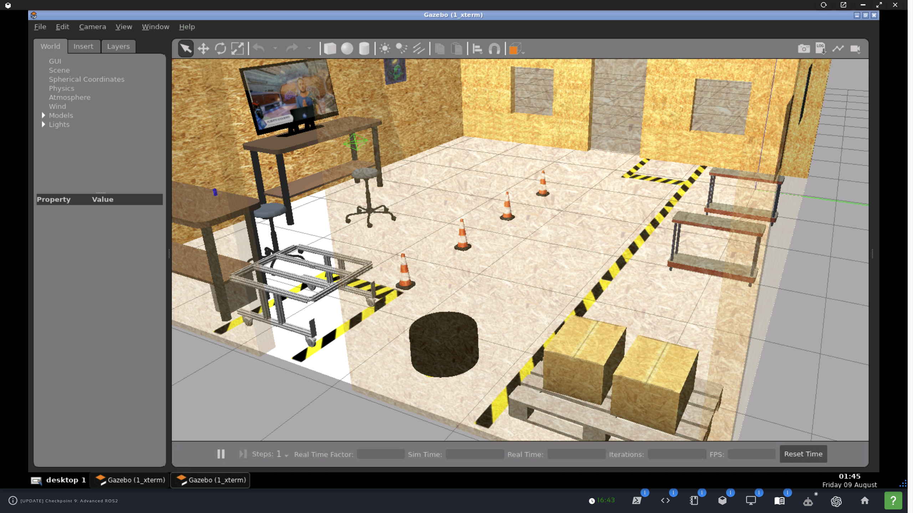 | 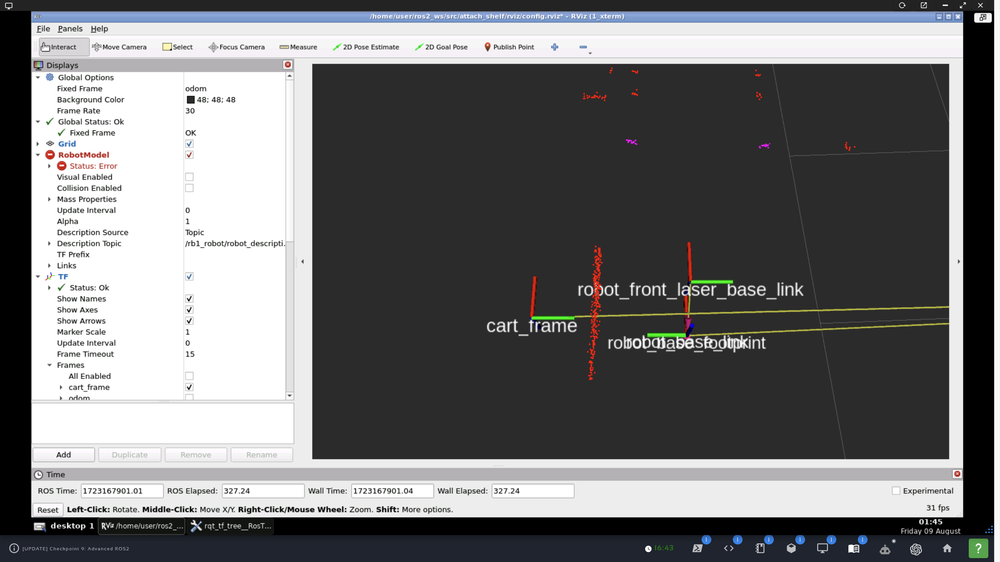 | 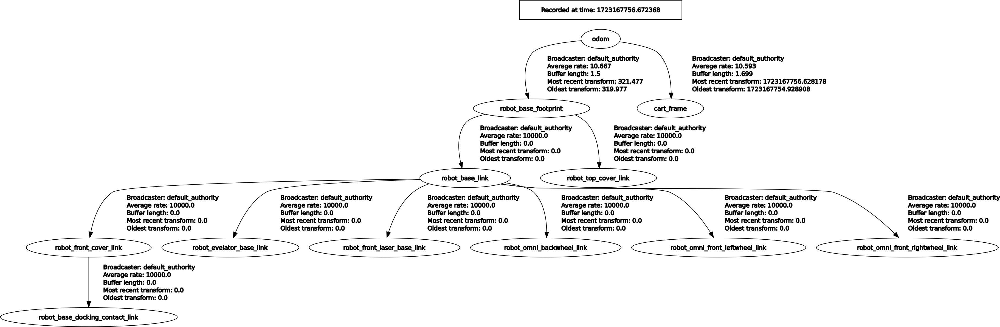 |  

Remaining problems:
1. `cart_frame` is in the wront position.
2. To avoid a mismatch in Gazebo and ROS2 (system) times like this:
   ```
   [INFO] [1723168735.547565617] [tf2_echo]: Waiting for transform robot_front_laser_base_link ->  cart_frame: Lookup would require extrapolation into the past.  Requested time 1234.377000 but the earliest data is at time 1723168725.641735, when looking up transform from frame [cart_frame] to frame [robot_front_laser_base_link]
   ```  
   add `parameters=[{'use_sim_time': True}],` to all launched `Node`-s
   and get the intended output
   ```
   At time 445.299000000
   - Translation: [-0.194, -0.739, -0.000]
   - Rotation: in Quaternion [-0.000, 0.000, 0.002, 1.000]
   - Rotation: in RPY (radian) [-0.000, 0.000, 0.003]
   - Rotation: in RPY (degree) [-0.000, 0.000, 0.175]
   - Matrix:
     1.000 -0.003 -0.000 -0.194
     0.003  1.000  0.000 -0.739
    -0.000 -0.000  1.000 -0.000
     0.000  0.000  0.000  1.000
   ```


##### 4. `tf2_ros::TransformListener` for precision movement

1. Use a `TransformListener` with `cart_frame` and `robot_base_footprint` frame of the robot to issue precision commands for the final approach.


##### 5. Parametrizing the laser scanner

1. This is a weird one!
   ```
   angle_min: -2.3561999797821045
   angle_max: 2.3561999797821045
   angle_increment: 0.004363333340734243
   time_increment: 0.0
   scan_time: 0.0
   range_min: 0.05999999865889549
   range_max: 20.0
   ```
2. [`LaserScannerPoker`](src/laser_scanner_poker.cpp) for reporting the parameters:
   ```
   [laser_scanner_poker_node-1] [INFO] [1722708445.226614735] [laser_scanner_poker_node]: angle_min = -2.356200 rad
   [laser_scanner_poker_node-1] [INFO] [1722708445.226731971] [laser_scanner_poker_node]: angle_max = 2.356200 rad
   [laser_scanner_poker_node-1] [INFO] [1722708445.226743815] [laser_scanner_poker_node]: angle_increment = 0.004363 rad
   [laser_scanner_poker_node-1] [INFO] [1722708445.226753163] [laser_scanner_poker_node]: range_min = 0.060000 rad
   [laser_scanner_poker_node-1] [INFO] [1722708445.226761269] [laser_scanner_poker_node]: range_max = 20.000000 rad
   [laser_scanner_poker_node-1] [INFO] [1722708445.226769927] [laser_scanner_poker_node]: ranges size = 1081
   ```
3. **NOTE:** Most importantly, it cycles CW so index 0 is at angle ~135 degrees, exactly the opposite of the standard direction and convention. See [data/full_scanner.txt](data/full_scanner.txt) for a single run with the robot having completed the pre-approach and facing the cart/shelf. See the `inf` runs when the scanner passes through the two doors.  
   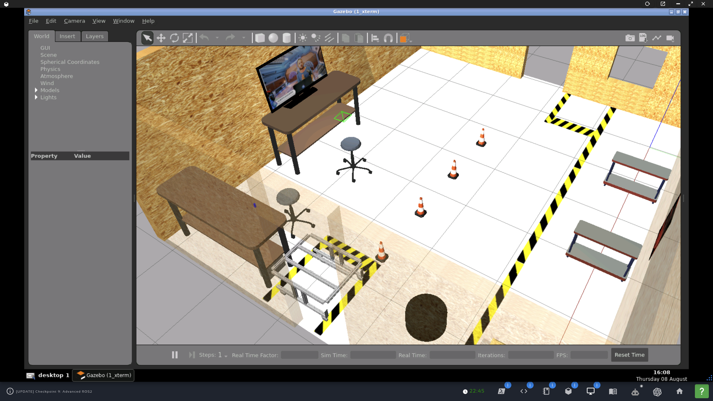  

##### 6. Logging

1. Setting logging severity level (map frees from dependency on actual values):
   ```
   std::map<int, std::string> levels = {
       {RCUTILS_LOG_SEVERITY::RCUTILS_LOG_SEVERITY_DEBUG, "DEBUG"},
       {RCUTILS_LOG_SEVERITY::RCUTILS_LOG_SEVERITY_INFO, "INFO"},
       {RCUTILS_LOG_SEVERITY::RCUTILS_LOG_SEVERITY_WARN, "WARN"},
       {RCUTILS_LOG_SEVERITY::RCUTILS_LOG_SEVERITY_ERROR, "ERROR"},
       {RCUTILS_LOG_SEVERITY::RCUTILS_LOG_SEVERITY_FATAL, "FATAL"}
   };
   int level = RCUTILS_LOG_SEVERITY::RCUTILS_LOG_SEVERITY_INFO;
   if (rcutils_logging_set_logger_level(logger.get_name(), level) !=
       RCUTILS_RET_OK) {
     RCLCPP_ERROR(logger,
                  "Failed to set logger level '%s' for rb1_pre_approach_node.",
                  (levels[level]).c_str());
   } else {
     RCLCPP_INFO(logger,
                 "Successfully set logger level '%s' for rb1_pre_approach_node.",
                 (levels[level]).c_str());
   }
   ```
2. Available settings (should not rely on these int values):
   ```
   enum RCUTILS_LOG_SEVERITY {
       RCUTILS_LOG_SEVERITY_DEBUG = 0, 
       RCUTILS_LOG_SEVERITY_INFO = 1, 
       RCUTILS_LOG_SEVERITY_WARN = 2, 
       RCUTILS_LOG_SEVERITY_ERROR = 3,
       RCUTILS_LOG_SEVERITY_FATAL = 4
   }
   ```

##### 7. Using parameters and arguments from launch file

1. Launch file declares parameters by name and default value, which is not enough by itself. See next step
   ```
   <?xml version='1.0' ?>
   <launch>
   
       <!-- Launch the pre-approach node -->
       <node pkg="attach_shelf" exec="pre_approach_node" name="pre_approach_node">
           <param name="obstacle" value="0.30" />
           <param name="degrees" value="-90.0" />
       </node>
   </launch>
   ```

2. Node class constructor declares the parameters by name and gets their values. Now ROS2 knows about them
   ```
   // Parameter: obstacle
   auto param_desc = rcl_interfaces::msg::ParameterDescriptor{};
   param_desc.description = "Sets the distance (in m) from the wall at which the robot should stop to reach the shelf.";
   this->declare_parameter<std::double_t>("obstacle", 0.0, param_desc);
   this->get_parameter("obstacle", obstacle_);

   // Parameter: degrees
   param_desc.description = "Sets the degrees (in deg) the robot should turn to face the shelf.";
   this->declare_parameter<std::double_t>("degrees", 0.0, param_desc);
   this->get_parameter("degrees", degrees_);
   ```

3. ROS2 reports the parameters for the node
   ```
   user:~/ros2_ws/src/parameter_tests/yaml$ ros2 param list | grep -A 7 pre_approach_node
   /pre_approach_node:
     degrees
     obstacle
     qos_overrides./parameter_events.publisher.depth
     qos_overrides./parameter_events.publisher.durability
     qos_overrides./parameter_events.publisher.history
     qos_overrides./parameter_events.publisher.reliability
     use_sim_time
   ```

4. To receive command-line arguments as in ros2 launch attach_shelf pre_approach.launch.xml obstacle:=0.3 degrees:=-90`, the XML launch file needs to delcare the arguments, as follows
   ```
   <?xml version='1.0' ?>
   <launch>

       <arg name="obstacle" default="0.3"/>
       <arg name="degrees" default="-90.0"/>

       <!-- Launch the pre-approach node -->
       <node pkg="attach_shelf" exec="pre_approach_node" name="pre_approach_node">
           <param name="obstacle" value="$(var obstacle)"/>
           <param name="degrees" value="$(var degrees)"/>
       </node>

   </launch>
   ```

5. Launch arguments delcared in the Python launch file are sent through the `argv` array and can be extracted in a straightforward manner as, for example, `turning_speed = std::stof(argv[2]);`. The following allows the arguments to be specified in any order while passing it on to the executable in the the order declared, making the order predictable for the source code.
```
def generate_launch_description():

    obstacle_arg = DeclareLaunchArgument(
        "obstacle", default_value="0.30"
    )
    degrees_arg = DeclareLaunchArgument(
        "degrees", default_value="-90.0"
    )

    obstacle_f = LaunchConfiguration('obstacle')
    degrees_f = LaunchConfiguration('degrees')

    pre_approach_node = Node(
        package='attach_shelf',
        executable='pre_approach_v2_node',
        output='screen',
        name='pre_approach_v2_node',
        emulate_tty=True,
        arguments=["-obstacle", obstacle_f,
                   "-degrees", degrees_f,
                   ]
    )

    # create and return launch description object
    return LaunchDescription(
        [
            obstacle_arg,
            degrees_arg,
            pre_approach_node
        ]
    )
```

6. Show arguments of a launch file
```
user:~/ros2_ws$ ros2 launch attach_shelf attach_to_shelf.launch.py --show-args
Arguments (pass arguments as '<name>:=<value>'):

    'obstacle':
        no description given
        (default: '0.30')

    'degrees':
        no description given
        (default: '-90.0')

    'final_approach':
        no description given
        (default: 'false')
```

