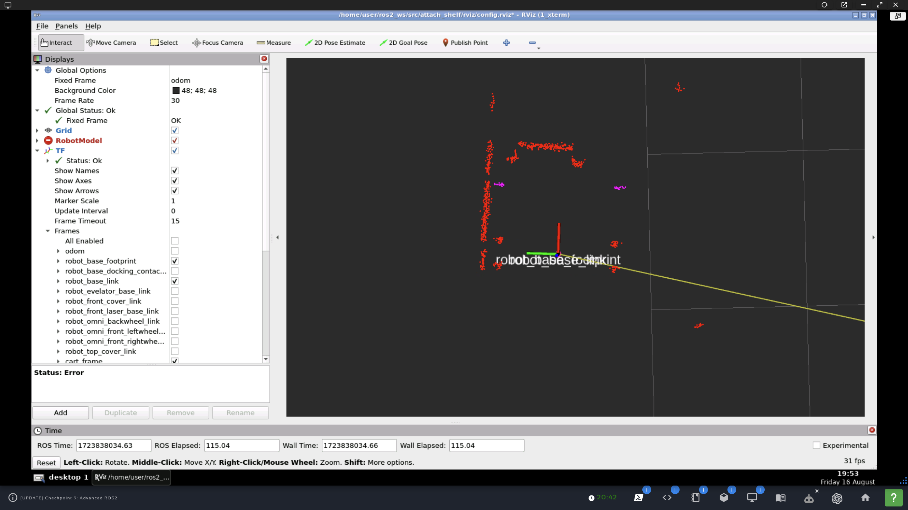
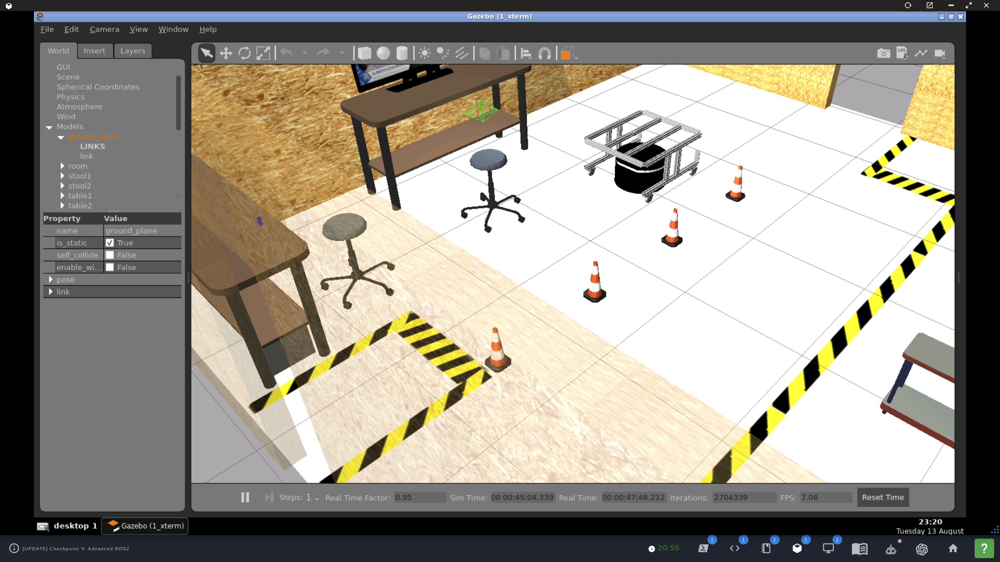

Table of Contents
=================

* [attach_shelf](#attach_shelf)
    * [Submission notes](#submission-notes)
    * [1. Task 1 - Pre-approach](#1-task-1---pre-approach)
    * [2. Task 2 - Final approach](#2-task-2---final-approach)
    * [Implementation notes*](#implementation-notes)
    * [1. Put robot back in initial state in Gazebo w/o restart](#1-put-robot-back-in-initial-state-in-gazebo-wo-restart)
    * [2. ROS2 objects](#2-ros2-objects)
    * [3. Adding a frame](#3-adding-a-frame)
        * [3.1. Brainstorming](#31-brainstorming)
        * [3.2 Brainstorming](#32-brainstorming)
        * [3.3 Strategy after brainstorming](#33-strategy-after-brainstorming)
    * [4. tf2_ros::TransformListener for precision movement](#4-tf2_rostransformlistener-for-precision-movement)
    * [5. Parametrizing the laser scanner](#5-parametrizing-the-laser-scanner)
    * [6. Logging](#6-logging)
    * [7. Using parameters and arguments from launch file](#7-using-parameters-and-arguments-from-launch-file)
    * [8. Attaching to the shelf/cart](#8-attaching-to-the-shelfcart)
    * [9. Terminating a service](#9-terminating-a-service)
    * [10. Rewriting approach and attachment to cart](#10-rewriting-approach-and-attachment-to-cart)
        * [10.1 Notes](#101-notes)
        * [10.2 Sequence of actions](#102-sequence-of-actions)

<!-- Created by https://github.com/ekalinin/github-markdown-toc -->

### attach_shelf

An RB1 robot in a simulated warehouse world moves forward, turns, detects a shelf, moves underneath it and attaches to it by raising its elevator.

  

#### Submission notes

##### 1. Task 1 - Pre-approach

1. Launching
   ```
   cd ~/ros2_ws/src
   git clone https://github.com/ivogeorg/attach_shelf.git
   checkout checkpoint-9-revised
   cd ~/ros2_ws
   colcon build --packages-select attach_shelf
   source install/setup.bash
   ros2 launch attach_shelf pre_approach.launch.xml obstacle:=0.39 degrees:=-92.0
   ```
2. Note that the values for the arguments do not need to have such precision as the noise in the robot movement defeats them most of the time. It is not possible to achieve perfect alignment of the robot and the shelf/crate so that the robot can move underneath it by only going forward. The `/approach_shelf` is more likely to achieve sufficient accuracy by using a `TransformListener` and issue corrective `Twist` messages to the robot as it approaches.
3. Expected result
   | Gazebo | Rviz2 |
   | --- | --- |
   |  |  |

##### 2. Task 2 - Final approach

1. Launching
   ```
   cd ~/ros2_ws/src
   git clone https://github.com/ivogeorg/attach_shelf.git
   checkout checkpoint-9-revised
   cd ~/ros2_ws
   colcon build --packages-select attach_shelf
   source install/setup.bash
   ros2 launch attach_shelf attach_to_shelf.launch.py obstacle:=0.30 degrees:=-90.0 final_approach:=true
   ```
2. Notes:
   1. There is a strange left-wheel slip front left of the cart which requires a complex navigation algorithm to compensate for automatically.
   2. The TF `cart_frame` remains published if `attach_to_shelf` is `false` but stops broadcasting once the robot reaches it if `attach_to_shelf` is `true`.
   3. The notebook is incorrect in its instructions about publishing to the `/elevator_up` topic. It's not of type `std_msgs/msg/Empty` but `std_msgs/msg/String`.
   4. Sending `msg.data=1` causes the shelf/cart to be attached to the robot. Interestingly, the robot doesn't have to be underneath; the shelf/cart will "jump" to where the robot is and get attached. I have tried not to cheat with that.
   5. Due to the signature of `Node::create_subscription()`, where any callback group membership has to be indicated in the `SubscriptionOptions`, a simple derived class `CustomSubscriptionOptions` is used to initialize an options object with a callback group object and then passed to the topic subscription creators.
3. Expected result
   | Gazebo | Rviz2 |
   | --- | --- |
   |  |  |  


#### Implementation notes*

_*Cumulative for both Task 1 and Task 2._  

##### 1. Put robot back in initial state in Gazebo w/o restart

_Optional_  

1. Can use the `/demo/set_entity_state` service to put the robot in the initial position for repeated testing.  
2. The service is of type `gazebo_msgs/srv/SetEntityState`.
3. The service server is provided by node `/demo/gazebo_ros_state`.  
4. Probably need to use `/demo/get_entity_state` to get the initial state.  

##### 2. ROS2 objects

1. Subscriber to `/scan` (`sensor_msgs/msg/LaserScan`).
2. Subscriber to `/odom` (`nav_msgs/msg/Odometry`).
3. Publisher to `/diffbot_base_controller/cmd_vel_unstamped` (`geometry_msgs/msg/Twist`).
4. Timer for velocity publisher.
5. Server for service `/approach_shelf` (custom `GoToLanding.srv`).
6. Client to service `/approach_shelf` (custom `GoToLanding.srv`).  
7. Publisher to `/elevator_up` (`std_msgs/msg/String`).  
8. Transform listener.

##### 3. Adding a frame

Need to add a frame in the middle of the reflective plates of the shelf.  

  

1. General approach:
   1. Use the `intensities` array of the `sensor_msgs/msg/LaserScan` to identify the points of incidence on the two reflective plates. The intensities should be significantly higher for them than for other points.
   2. There should be two clusters. Use the `ranges` to get their centers. Then find the midpoint between them.
   3. Use this point to add a frame `cart_frame` to the tree. Tutorial for [adding a frame](https://docs.ros.org/en/humble/Tutorials/Intermediate/Tf2/Adding-A-Frame-Cpp.html).  
2. Algorithmic details:
   1. The origin frame of the scanner is `robot_front_laser_base_link`. Using the angle of a ray and its measured range to a point can yield the point's frame.
   2. The frames of the high-intesity points can be used for 3D k-means clustering, which will yield 1 or 2 clusters and the cluster centroids (with frames).
   3. From two points in 3D space, the midpoint between them can be found. The frame `cart_frame` can be computed and arranged so that it represents a meaningful motion goal for the robot.
   4. Using a transform between `robot_front_laser_base_link` and `cart_frame`, send `Twist` messages to the robot to move toward `cart_frame`.
   5. Move the robot forward for 30 more cm. This can be done with another frame or with `Odomerty` data.
3. The goal is:
      
4. The `cart_frame` has to be relative to the root of the world, in this case `odom`, otherwise it will move with the robot.  
5. The world coordinates of `cart_fram` can be calculated by "adding" a transform from a known transform, say, between `odom` and `robot_front_laser_base_link`, while the robot is stopped. Here is the latter TF:
   ```
   At time 1277.200000000
   - Translation: [5.777, -0.147, 0.235]
   - Rotation: in Quaternion [-0.699, 0.715, -0.000, -0.000]
   - Rotation: in RPY (radian) [-3.142, -0.000, -1.592]
   - Rotation: in RPY (degree) [-180.000, -0.000, -91.230]
   - Matrix:
    -0.021 -1.000 -0.000  5.777
    -1.000  0.021 -0.000 -0.147
     0.000 -0.000 -1.000  0.235
     0.000  0.000  0.000  1.000
   ```  
6. `cart_frame` will only have an `x` and a `y` component (and possibly a yaw) relative to `robot_front_laser_base_link`. So, these are two transforms, which need to be combined, by matrix multiplication (except we don't have a matrix for the latter) or some other way. _How to combine?_
7. This is the SAS triangle diagram:
   ```
   /***********************************************************
                frame_length
     \------------|--y-->.------------------/
      \rsa        |pi/2  .             lsa/
       \          |     .               /
        \         |     .             /
         \        |    .            /                 +x
          \    h/x|    .bisect    /
           \      |   .         /                      ^
      l_side\     |   .--ba   /r_side                  |
             \    |---ha   \/                          |
              \   |w .  \ /                    +yaw /--|--\ -yaw
               \  |a.   /                           V  |  V
                \ |y. /                      -y <----- | -----> +y
                 \|./                        (in laser link frame)
                  V - sas_angle
   ***********************************************************/
   ```

| Gazebo | Rviz2 |
| --- | --- |
|  |  |   

###### 3.1. Brainstorming

Briefly, after the RB1 robot has completed the pre-approach, has faced the crate/shelf, and has identified the two reflective plates, this TF needs to be added right in between the reflective plates. Questions:
1. In the image showing the new TF in Rviz2, `cart_frame` seems to be defined relative to `robot_front_laser_base_link`. The arrow points from `cart_frame` to `robot_front_laser_base_link`. If the robot moves, won't `cart_frame` also move?
2. If we use a `TransformBroadcaster` instead of a `StaticTransformBroadcaster` to define `cart_frame` relative to `robot_front_laser_base_link`, won't it still move to maintain the definition relative to `robot_front_laser_base_link`?
3. Shouldn't `cart_frame`, which we need to stay in place to be used for moving the robot toward it, be defined in a transform from `odom` (or whatever the root link in the TF tree is)?
4. If `cart_frame` will move with `robot_front_laser_base_link`, do we have to recalculate the point and modify the TF broadcast? That seems to be counterintuitive, not to mention difficult, because the reflective plates will disappear from "laser view" as the robot approaches the crate/shelf.

###### 3.2 Brainstorming

1. `cart_frame` should be defined as a TF relative to `odom`.
2. Solve the SAS triangle. Get:
   1. The `x` and `y` coordinates of `cart_frame` relative to `robot_front_laser_base_link`.
   2. Get the angle of `cart_frame` from `robot_front_laser_base_link`.
3. Use a `TransformBroadcaster` to publish `cart_frame` relative to `robot_front_laser_base_link` once.
4. Use `tf_buffer.lookupTransform` between `odom` and `cart_frame`.
5. Use a `StaticTransformBroadcaster` to publish the TF between `odom` and `cart_frame`. By default, this is published once. 
6. Proceed with the final approach.

###### 3.3 Strategy after brainstorming

**Note:** All in code. No hardcoding!  

1. Solve the SAS triangle to get the `x` and `y` offsets between `robot_front_laser_base_link` and `cart_frame`. Call them `x_offset` and `y_offset`. These offsets are _relative_ to the `robot_front_laser_base_link` frame. This frame is rotated, so the positive `x` axis points forward and the positive `y` points -90 deg to the right. For completeness, the positive `z` axis points down. Therefore:
   1. The `x_offset` is always positive.
   2. The sign of the `y_offset` depends on the relative length of the ranges to the (innermost points of the) reflective plates. Note that the names `left_range` and `right_range` are correct due to the scanner rotating CW. 
      1. If `left_range > right_range`, `y_offset` is _negative_.
      2. If `left_range < right_range`, `y_offset` is _positive_.
      3. For completeness, if `left_range == right_range`, `y_offset` is _zero (0.0)_. This is unlikely considering the precision of the ranges.
2. Declare private `std::string source_frame_` and `std::string target_frame_`. They will serve as parameters for the `tf_buffer_.lookupTransform()`. Will require some `bool` vars to enforce the logic.
3. Declare private `geometry_msgs::msg::TransformStamped odom_laser_t_`. It will hold the transform `odom` to `robot_front_laser_base_link` whic, when the robot has completed the pre-approach, will be used to define the tranform `odom_cart_` from `odom` to `cart_frame` by adding the offsets `x_offset` and `y_offset`. Then it will be zeroed out by assigning to a newly declared local variable.
4. Declare private `geometry_msgs::msg::TransformStamped odom_cart_t_`. It will hold the transform `odom` to `cart_frame` to be used by TF to look up the tranform `laser_cart_t_`.
5. Declare private `geometry_msgs::msg::TransformStamped laser_cart_t_`. It will hold the transform `robot_front_laser_base_link` to `cart_frame`, which will be broadcast for the final approach of the robot.
6. Declare private `std::unique_ptr<tf2_ros::Buffer> tf_buffer_`. It will serve to call `lookupTransform`. It will serve two purposes:
   1. If `source_frame_ == "odom"` and `target_frame_ == "robot_front_laser_base_link", keep updating `odom_laser_t_`. 
   2. If `source_frame_ == "robot_front_laser_base_link"` and `target_frame_ == "cart_frame", keep updating `laser_cart_t_`. 
7. Declare private `std::shared_ptr<tf2_ros::TransformListener> tf_listener_`. It will serve to "wrap" the `tf_buffer_`.
8. Declare private `rclcpp::TimerBase::SharedPtr listener_timer_`. It will serve to call the listener callback.
9. Declare private `void listener_cb()`. It will call `tf_buffer_.lookupTransform()` with `source_frame_` and `target_frame_` and enforce the logic of the dual use of the listener.
10. Declare private `std::shared_ptr<tf2_ros::TransformBroadcaster> tf_broadcaster_`. It will serve to broadcast `laser_cart_t_` for the final approach of the robot.
11. Declare private `rclcpp::TimerBase::SharedPtr broadcaster_timer_`. It will serve to call the broadcaster callback.
12. Declare private `void broadcaster_cb()`. It will call `tf_broadcaster_->sendTransform(odom_cart_t_)`.

The final strategy, including some extra multithreading infrastructure, worked:  
| Gazebo | Rviz2 | rqt_tf_tree |
| --- | --- | --- |
|  |  |  |   

At `obstacle=0.45`, robot can reach `cart_frame` without complex computations:
  
  

**Notes on important details:**
1. `cart_frame` requires transform _chaining_:
```
  // Chain transforms
  // Express the offsets in a new TransformStamped
  geometry_msgs::msg::TransformStamped t;
  //   t.header.stamp = this->get_clock()->now();
  t.header.stamp = odom_laser_t_.header
                       .stamp; // TODO: Will same work or should it be advanced?
  t.header.frame_id = laser_frame_;
  t.child_frame_id = cart_frame_;
  t.transform.translation.x = x_offset;
  t.transform.translation.y = y_offset;
  t.transform.translation.z = 0.0;
  t.transform.rotation.x = 0.0;
  t.transform.rotation.y = 0.0;
  t.transform.rotation.z = 0.0;
  t.transform.rotation.w = 1.0;

  tf2::Transform tf_odom_laser;
  // Extract translation and rotation from TransformStamped
  tf_odom_laser.setOrigin(tf2::Vector3(odom_laser_t_.transform.translation.x,
                                       odom_laser_t_.transform.translation.y,
                                       odom_laser_t_.transform.translation.z));
  tf_odom_laser.setRotation(tf2::Quaternion(
      odom_laser_t_.transform.rotation.x, odom_laser_t_.transform.rotation.y,
      odom_laser_t_.transform.rotation.z, odom_laser_t_.transform.rotation.w));

  tf2::Transform tf_laser_cart;
  // Extract translation and rotation from TransformStamped
  tf_laser_cart.setOrigin(tf2::Vector3(t.transform.translation.x,
                                       t.transform.translation.y,
                                       t.transform.translation.z));
  tf_laser_cart.setRotation(
      tf2::Quaternion(t.transform.rotation.x, t.transform.rotation.y,
                      t.transform.rotation.z, t.transform.rotation.w));

  // Chain the transforms
  tf2::Transform tf_odom_cart = tf_odom_laser * tf_laser_cart;

  // Fill in the header of odom_cart_t_
  odom_cart_t_.header.stamp = this->get_clock()->now();
  odom_cart_t_.header.frame_id = odom_frame_;
  odom_cart_t_.child_frame_id = cart_frame_;

  // Directly assign the transform components
  odom_cart_t_.transform.translation.x = tf_odom_cart.getOrigin().x();
  odom_cart_t_.transform.translation.y = tf_odom_cart.getOrigin().y();
  odom_cart_t_.transform.translation.z = tf_odom_cart.getOrigin().z();

  odom_cart_t_.transform.rotation.x = tf_odom_cart.getRotation().x();
  odom_cart_t_.transform.rotation.y = tf_odom_cart.getRotation().y();
  odom_cart_t_.transform.rotation.z = tf_odom_cart.getRotation().z();
  odom_cart_t_.transform.rotation.w = tf_odom_cart.getRotation().w();

  // 2. Add a `cart_frame` TF frame in between them.
  broadcast_odom_cart_ = true;
```
2. To avoid a mismatch in Gazebo and ROS2 (system) times like this:
   ```
   [INFO] [1723168735.547565617] [tf2_echo]: Waiting for transform robot_front_laser_base_link ->  cart_frame: Lookup would require extrapolation into the past.  Requested time 1234.377000 but the earliest data is at time 1723168725.641735, when looking up transform from frame [cart_frame] to frame [robot_front_laser_base_link]
   ```  
   add `parameters=[{'use_sim_time': True}],` to all launched `Node`-s
   and get the intended output
   ```
   At time 445.299000000
   - Translation: [-0.194, -0.739, -0.000]
   - Rotation: in Quaternion [-0.000, 0.000, 0.002, 1.000]
   - Rotation: in RPY (radian) [-0.000, 0.000, 0.003]
   - Rotation: in RPY (degree) [-0.000, 0.000, 0.175]
   - Matrix:
     1.000 -0.003 -0.000 -0.194
     0.003  1.000  0.000 -0.739
    -0.000 -0.000  1.000 -0.000
     0.000  0.000  0.000  1.000
   ```


##### 4. `tf2_ros::TransformListener` for precision movement

1. Use a `TransformListener` with `cart_frame` and `robot_base_footprint` frame of the robot to issue precision commands for the final approach.
2. Correct the pose of the robot before approach. Since the main linear approach will be guided by the TF between `robot_base_link` and `cart_frame`, but `cart_frame` was originally defined relative to `robot_front_laser_base_link`, the robot should travel forward along the `x` dimension (because the two frames are aligned) the distance between `robot_base_link` and `robot_front_laser_base_link`, which is `0.21` as can be seen in the [xacro file used to spawn the RB1 robot](xacro/rb1_ros2_base.urdf.xacro).
3. Precision movement impossible with drifting `odom/` alone. Look at the following curve which should be a straight line as only `twist.linear.x` is non-zero:
```
[approach_shelf_service_server_node-1] [INFO] [1723821045.867948241] [approach_shelf_service_server_node]: Facing shelf
[approach_shelf_service_server_node-1] [DEBUG] [1723821045.867976347] [approach_shelf_service_server_node]: Turning goal -0.177402 rad
[approach_shelf_service_server_node-1] [DEBUG] [1723821050.177999427] [approach_shelf_service_server_node]: Done turning, turn angle = -0.167685 rad. Stopping
[approach_shelf_service_server_node-1] [INFO] [1723821050.178088714] [approach_shelf_service_server_node]: Approaching shelf
[approach_shelf_service_server_node-1] [DEBUG] [1723821050.235157242] [approach_shelf_service_server_node]: listener_cb: delta_x = 0.970213 m
[approach_shelf_service_server_node-1] [DEBUG] [1723821050.235242511] [approach_shelf_service_server_node]: listener_cb: error_distance = 0.970395 m
[approach_shelf_service_server_node-1] [DEBUG] [1723821050.235272393] [approach_shelf_service_server_node]: listener_cb: error_yaw = 0.162756 rad
[approach_shelf_service_server_node-1] [DEBUG] [1723821050.235294622] [approach_shelf_service_server_node]: Moving robot toward `cart_frame` (x=0.727796, z=0.000000)
[approach_shelf_service_server_node-1] [DEBUG] [1723821050.335098989] [approach_shelf_service_server_node]: listener_cb: delta_x = 0.969543 m
[approach_shelf_service_server_node-1] [DEBUG] [1723821050.335205083] [approach_shelf_service_server_node]: listener_cb: error_distance = 0.969812 m
[approach_shelf_service_server_node-1] [DEBUG] [1723821050.335228154] [approach_shelf_service_server_node]: listener_cb: error_yaw = 0.166941 rad
[approach_shelf_service_server_node-1] [DEBUG] [1723821050.335246967] [approach_shelf_service_server_node]: Moving robot toward `cart_frame` (x=0.727359, z=0.000000)
[approach_shelf_service_server_node-1] [DEBUG] [1723821050.435108703] [approach_shelf_service_server_node]: listener_cb: delta_x = 0.969058 m
[approach_shelf_service_server_node-1] [DEBUG] [1723821050.435203106] [approach_shelf_service_server_node]: listener_cb: error_distance = 0.969398 m
[approach_shelf_service_server_node-1] [DEBUG] [1723821050.435222103] [approach_shelf_service_server_node]: listener_cb: error_yaw = 0.169893 rad
[approach_shelf_service_server_node-1] [DEBUG] [1723821050.435238035] [approach_shelf_service_server_node]: Moving robot toward `cart_frame` (x=0.727048, z=0.000000)
[approach_shelf_service_server_node-1] [DEBUG] [1723821050.535098591] [approach_shelf_service_server_node]: listener_cb: delta_x = 0.965476 m
[approach_shelf_service_server_node-1] [DEBUG] [1723821050.535183547] [approach_shelf_service_server_node]: listener_cb: error_distance = 0.965749 m
[approach_shelf_service_server_node-1] [DEBUG] [1723821050.535200113] [approach_shelf_service_server_node]: listener_cb: error_yaw = 0.167109 rad
[approach_shelf_service_server_node-1] [DEBUG] [1723821050.535213499] [approach_shelf_service_server_node]: Moving robot toward `cart_frame` (x=0.724312, z=0.000000)
[approach_shelf_service_server_node-1] [DEBUG] [1723821050.636371759] [approach_shelf_service_server_node]: listener_cb: delta_x = 0.955244 m
[approach_shelf_service_server_node-1] [DEBUG] [1723821050.636464956] [approach_shelf_service_server_node]: listener_cb: error_distance = 0.955313 m
[approach_shelf_service_server_node-1] [DEBUG] [1723821050.636491963] [approach_shelf_service_server_node]: listener_cb: error_yaw = 0.155189 rad
[approach_shelf_service_server_node-1] [DEBUG] [1723821050.636507694] [approach_shelf_service_server_node]: Moving robot toward `cart_frame` (x=0.716485, z=0.000000)
[approach_shelf_service_server_node-1] [DEBUG] [1723821050.735103658] [approach_shelf_service_server_node]: listener_cb: delta_x = 0.936957 m
[approach_shelf_service_server_node-1] [DEBUG] [1723821050.735198605] [approach_shelf_service_server_node]: listener_cb: error_distance = 0.936979 m
[approach_shelf_service_server_node-1] [DEBUG] [1723821050.735217795] [approach_shelf_service_server_node]: listener_cb: error_yaw = 0.136205 rad
[approach_shelf_service_server_node-1] [DEBUG] [1723821050.735233826] [approach_shelf_service_server_node]: Moving robot toward `cart_frame` (x=0.702734, z=0.000000)
[approach_shelf_service_server_node-1] [DEBUG] [1723821050.835137458] [approach_shelf_service_server_node]: listener_cb: delta_x = 0.912663 m
[approach_shelf_service_server_node-1] [DEBUG] [1723821050.835219296] [approach_shelf_service_server_node]: listener_cb: error_distance = 0.913045 m
[approach_shelf_service_server_node-1] [DEBUG] [1723821050.835237553] [approach_shelf_service_server_node]: listener_cb: error_yaw = 0.114726 rad
[approach_shelf_service_server_node-1] [DEBUG] [1723821050.835253748] [approach_shelf_service_server_node]: Moving robot toward `cart_frame` (x=0.684784, z=0.000000)
[approach_shelf_service_server_node-1] [DEBUG] [1723821050.935139778] [approach_shelf_service_server_node]: listener_cb: delta_x = 0.874568 m
[approach_shelf_service_server_node-1] [DEBUG] [1723821050.935758391] [approach_shelf_service_server_node]: listener_cb: error_distance = 0.876063 m
[approach_shelf_service_server_node-1] [DEBUG] [1723821050.935791110] [approach_shelf_service_server_node]: listener_cb: error_yaw = 0.087078 rad
[approach_shelf_service_server_node-1] [DEBUG] [1723821050.935814381] [approach_shelf_service_server_node]: Moving robot toward `cart_frame` (x=0.657047, z=0.000000)
[approach_shelf_service_server_node-1] [DEBUG] [1723821051.035099316] [approach_shelf_service_server_node]: listener_cb: delta_x = 0.825127 m
[approach_shelf_service_server_node-1] [DEBUG] [1723821051.035632817] [approach_shelf_service_server_node]: listener_cb: error_distance = 0.827672 m
[approach_shelf_service_server_node-1] [DEBUG] [1723821051.035659087] [approach_shelf_service_server_node]: listener_cb: error_yaw = 0.071019 rad
[approach_shelf_service_server_node-1] [DEBUG] [1723821051.035678365] [approach_shelf_service_server_node]: Moving robot toward `cart_frame` (x=0.620754, z=0.000000)
[approach_shelf_service_server_node-1] [DEBUG] [1723821051.135104503] [approach_shelf_service_server_node]: listener_cb: delta_x = 0.772894 m
[approach_shelf_service_server_node-1] [DEBUG] [1723821051.135187029] [approach_shelf_service_server_node]: listener_cb: error_distance = 0.776397 m
[approach_shelf_service_server_node-1] [DEBUG] [1723821051.135215705] [approach_shelf_service_server_node]: listener_cb: error_yaw = 0.060013 rad
[approach_shelf_service_server_node-1] [DEBUG] [1723821051.135239651] [approach_shelf_service_server_node]: Moving robot toward `cart_frame` (x=0.582298, z=0.000000)
[approach_shelf_service_server_node-1] [DEBUG] [1723821051.235129379] [approach_shelf_service_server_node]: listener_cb: delta_x = 0.723856 m
[approach_shelf_service_server_node-1] [DEBUG] [1723821051.235243788] [approach_shelf_service_server_node]: listener_cb: error_distance = 0.728396 m
[approach_shelf_service_server_node-1] [DEBUG] [1723821051.235267066] [approach_shelf_service_server_node]: listener_cb: error_yaw = 0.049951 rad
[approach_shelf_service_server_node-1] [DEBUG] [1723821051.235301822] [approach_shelf_service_server_node]: Moving robot toward `cart_frame` (x=0.546297, z=0.000000)
[approach_shelf_service_server_node-1] [DEBUG] [1723821051.335102064] [approach_shelf_service_server_node]: listener_cb: delta_x = 0.665056 m
[approach_shelf_service_server_node-1] [DEBUG] [1723821051.335180271] [approach_shelf_service_server_node]: listener_cb: error_distance = 0.670782 m
[approach_shelf_service_server_node-1] [DEBUG] [1723821051.335200361] [approach_shelf_service_server_node]: listener_cb: error_yaw = 0.040934 rad
[approach_shelf_service_server_node-1] [DEBUG] [1723821051.335217314] [approach_shelf_service_server_node]: Moving robot toward `cart_frame` (x=0.503086, z=0.000000)
[approach_shelf_service_server_node-1] [DEBUG] [1723821051.435127719] [approach_shelf_service_server_node]: listener_cb: delta_x = 0.606691 m
[approach_shelf_service_server_node-1] [DEBUG] [1723821051.435236627] [approach_shelf_service_server_node]: listener_cb: error_distance = 0.613471 m
[approach_shelf_service_server_node-1] [DEBUG] [1723821051.435261135] [approach_shelf_service_server_node]: listener_cb: error_yaw = 0.035429 rad
[approach_shelf_service_server_node-1] [DEBUG] [1723821051.435281358] [approach_shelf_service_server_node]: Moving robot toward `cart_frame` (x=0.460104, z=0.000000)
[approach_shelf_service_server_node-1] [DEBUG] [1723821051.535128460] [approach_shelf_service_server_node]: listener_cb: delta_x = 0.558758 m
[approach_shelf_service_server_node-1] [DEBUG] [1723821051.535214377] [approach_shelf_service_server_node]: listener_cb: error_distance = 0.566506 m
[approach_shelf_service_server_node-1] [DEBUG] [1723821051.535248100] [approach_shelf_service_server_node]: listener_cb: error_yaw = 0.031259 rad
[approach_shelf_service_server_node-1] [DEBUG] [1723821051.535267693] [approach_shelf_service_server_node]: Moving robot toward `cart_frame` (x=0.424880, z=0.000000)
[approach_shelf_service_server_node-1] [DEBUG] [1723821051.635126449] [approach_shelf_service_server_node]: listener_cb: delta_x = 0.507998 m
[approach_shelf_service_server_node-1] [DEBUG] [1723821051.635227591] [approach_shelf_service_server_node]: listener_cb: error_distance = 0.516756 m
[approach_shelf_service_server_node-1] [DEBUG] [1723821051.635253757] [approach_shelf_service_server_node]: listener_cb: error_yaw = 0.028703 rad
[approach_shelf_service_server_node-1] [DEBUG] [1723821051.635273973] [approach_shelf_service_server_node]: Moving robot toward `cart_frame` (x=0.387567, z=0.000000)
[approach_shelf_service_server_node-1] [DEBUG] [1723821051.735144047] [approach_shelf_service_server_node]: listener_cb: delta_x = 0.465699 m
[approach_shelf_service_server_node-1] [DEBUG] [1723821051.735223598] [approach_shelf_service_server_node]: listener_cb: error_distance = 0.475470 m
[approach_shelf_service_server_node-1] [DEBUG] [1723821051.735242319] [approach_shelf_service_server_node]: listener_cb: error_yaw = 0.026318 rad
[approach_shelf_service_server_node-1] [DEBUG] [1723821051.735257421] [approach_shelf_service_server_node]: Moving robot toward `cart_frame` (x=0.356602, z=0.000000)
[approach_shelf_service_server_node-1] [DEBUG] [1723821051.835128530] [approach_shelf_service_server_node]: listener_cb: delta_x = 0.423901 m
[approach_shelf_service_server_node-1] [DEBUG] [1723821051.835264070] [approach_shelf_service_server_node]: listener_cb: error_distance = 0.434972 m
[approach_shelf_service_server_node-1] [DEBUG] [1723821051.835288989] [approach_shelf_service_server_node]: listener_cb: error_yaw = 0.022675 rad
[approach_shelf_service_server_node-1] [DEBUG] [1723821051.835311558] [approach_shelf_service_server_node]: Moving robot toward `cart_frame` (x=0.326229, z=0.000000)
[approach_shelf_service_server_node-1] [DEBUG] [1723821051.935105440] [approach_shelf_service_server_node]: listener_cb: delta_x = 0.388800 m
[approach_shelf_service_server_node-1] [DEBUG] [1723821051.935249940] [approach_shelf_service_server_node]: listener_cb: error_distance = 0.401296 m
[approach_shelf_service_server_node-1] [DEBUG] [1723821051.935279568] [approach_shelf_service_server_node]: listener_cb: error_yaw = 0.018103 rad
[approach_shelf_service_server_node-1] [DEBUG] [1723821051.935302570] [approach_shelf_service_server_node]: Moving robot toward `cart_frame` (x=0.300972, z=0.000000)
[approach_shelf_service_server_node-1] [DEBUG] [1723821052.035124251] [approach_shelf_service_server_node]: listener_cb: delta_x = 0.355402 m
[approach_shelf_service_server_node-1] [DEBUG] [1723821052.035219365] [approach_shelf_service_server_node]: listener_cb: error_distance = 0.369565 m
[approach_shelf_service_server_node-1] [DEBUG] [1723821052.035243912] [approach_shelf_service_server_node]: listener_cb: error_yaw = 0.012808 rad
[approach_shelf_service_server_node-1] [DEBUG] [1723821052.035258709] [approach_shelf_service_server_node]: Moving robot toward `cart_frame` (x=0.277173, z=0.000000)
[approach_shelf_service_server_node-1] [DEBUG] [1723821052.135146027] [approach_shelf_service_server_node]: listener_cb: delta_x = 0.328086 m
[approach_shelf_service_server_node-1] [DEBUG] [1723821052.135210455] [approach_shelf_service_server_node]: listener_cb: error_distance = 0.343609 m
[approach_shelf_service_server_node-1] [DEBUG] [1723821052.135225829] [approach_shelf_service_server_node]: listener_cb: error_yaw = 0.010514 rad
[approach_shelf_service_server_node-1] [DEBUG] [1723821052.135249608] [approach_shelf_service_server_node]: Moving robot toward `cart_frame` (x=0.257707, z=0.000000)
[approach_shelf_service_server_node-1] [DEBUG] [1723821052.235143085] [approach_shelf_service_server_node]: listener_cb: delta_x = 0.299225 m
[approach_shelf_service_server_node-1] [DEBUG] [1723821052.235229176] [approach_shelf_service_server_node]: listener_cb: error_distance = 0.316171 m
[approach_shelf_service_server_node-1] [DEBUG] [1723821052.235246614] [approach_shelf_service_server_node]: listener_cb: error_yaw = 0.010490 rad
[approach_shelf_service_server_node-1] [DEBUG] [1723821052.235261579] [approach_shelf_service_server_node]: Moving robot toward `cart_frame` (x=0.237128, z=0.000000)
[approach_shelf_service_server_node-1] [DEBUG] [1723821052.335209535] [approach_shelf_service_server_node]: listener_cb: delta_x = 0.269846 m
[approach_shelf_service_server_node-1] [DEBUG] [1723821052.335288833] [approach_shelf_service_server_node]: listener_cb: error_distance = 0.288792 m
[approach_shelf_service_server_node-1] [DEBUG] [1723821052.335306227] [approach_shelf_service_server_node]: listener_cb: error_yaw = 0.007812 rad
[approach_shelf_service_server_node-1] [DEBUG] [1723821052.335322407] [approach_shelf_service_server_node]: Moving robot toward `cart_frame` (x=0.216594, z=0.000000)
[approach_shelf_service_server_node-1] [DEBUG] [1723821052.435171732] [approach_shelf_service_server_node]: listener_cb: delta_x = 0.245975 m
[approach_shelf_service_server_node-1] [DEBUG] [1723821052.435325927] [approach_shelf_service_server_node]: listener_cb: error_distance = 0.266854 m
[approach_shelf_service_server_node-1] [DEBUG] [1723821052.435359780] [approach_shelf_service_server_node]: listener_cb: error_yaw = 0.005496 rad
[approach_shelf_service_server_node-1] [DEBUG] [1723821052.435400607] [approach_shelf_service_server_node]: Moving robot toward `cart_frame` (x=0.200140, z=0.000000)
[approach_shelf_service_server_node-1] [DEBUG] [1723821052.535165032] [approach_shelf_service_server_node]: listener_cb: delta_x = 0.226066 m
[approach_shelf_service_server_node-1] [DEBUG] [1723821052.535295960] [approach_shelf_service_server_node]: listener_cb: error_distance = 0.248789 m
[approach_shelf_service_server_node-1] [DEBUG] [1723821052.535325161] [approach_shelf_service_server_node]: listener_cb: error_yaw = 0.003815 rad
[approach_shelf_service_server_node-1] [DEBUG] [1723821052.535345537] [approach_shelf_service_server_node]: Moving robot toward `cart_frame` (x=0.186591, z=0.000000)
[approach_shelf_service_server_node-1] [DEBUG] [1723821052.635109560] [approach_shelf_service_server_node]: listener_cb: delta_x = 0.205016 m
[approach_shelf_service_server_node-1] [DEBUG] [1723821052.635199054] [approach_shelf_service_server_node]: listener_cb: error_distance = 0.229982 m
[approach_shelf_service_server_node-1] [DEBUG] [1723821052.635224145] [approach_shelf_service_server_node]: listener_cb: error_yaw = 0.002245 rad
[approach_shelf_service_server_node-1] [DEBUG] [1723821052.635244333] [approach_shelf_service_server_node]: Moving robot toward `cart_frame` (x=0.172486, z=0.000000)
[approach_shelf_service_server_node-1] [DEBUG] [1723821052.735123203] [approach_shelf_service_server_node]: listener_cb: delta_x = 0.186445 m
[approach_shelf_service_server_node-1] [DEBUG] [1723821052.735212125] [approach_shelf_service_server_node]: listener_cb: error_distance = 0.213708 m
[approach_shelf_service_server_node-1] [DEBUG] [1723821052.735235971] [approach_shelf_service_server_node]: listener_cb: error_yaw = 0.001035 rad
[approach_shelf_service_server_node-1] [DEBUG] [1723821052.735255852] [approach_shelf_service_server_node]: Moving robot toward `cart_frame` (x=0.160281, z=0.000000)
[approach_shelf_service_server_node-1] [DEBUG] [1723821052.835159090] [approach_shelf_service_server_node]: listener_cb: delta_x = 0.169233 m
[approach_shelf_service_server_node-1] [DEBUG] [1723821052.835243257] [approach_shelf_service_server_node]: listener_cb: error_distance = 0.198962 m
[approach_shelf_service_server_node-1] [DEBUG] [1723821052.835262735] [approach_shelf_service_server_node]: listener_cb: error_yaw = 0.000050 rad
[approach_shelf_service_server_node-1] [DEBUG] [1723821052.835280738] [approach_shelf_service_server_node]: Moving robot toward `cart_frame` (x=0.149221, z=0.000000)
[approach_shelf_service_server_node-1] [DEBUG] [1723821052.935136645] [approach_shelf_service_server_node]: listener_cb: delta_x = 0.154531 m
[approach_shelf_service_server_node-1] [DEBUG] [1723821052.935236240] [approach_shelf_service_server_node]: listener_cb: error_distance = 0.186685 m
[approach_shelf_service_server_node-1] [DEBUG] [1723821052.935258634] [approach_shelf_service_server_node]: listener_cb: error_yaw = -0.000705 rad
[approach_shelf_service_server_node-1] [DEBUG] [1723821052.935282623] [approach_shelf_service_server_node]: Moving robot toward `cart_frame` (x=0.140014, z=0.000000)
[approach_shelf_service_server_node-1] [DEBUG] [1723821053.035202825] [approach_shelf_service_server_node]: listener_cb: delta_x = 0.141952 m
[approach_shelf_service_server_node-1] [DEBUG] [1723821053.035282336] [approach_shelf_service_server_node]: listener_cb: error_distance = 0.176467 m
[approach_shelf_service_server_node-1] [DEBUG] [1723821053.035304177] [approach_shelf_service_server_node]: listener_cb: error_yaw = -0.001301 rad
[approach_shelf_service_server_node-1] [DEBUG] [1723821053.035323889] [approach_shelf_service_server_node]: Moving robot toward `cart_frame` (x=0.132350, z=0.000000)
[approach_shelf_service_server_node-1] [DEBUG] [1723821053.135140434] [approach_shelf_service_server_node]: listener_cb: delta_x = 0.129482 m
[approach_shelf_service_server_node-1] [DEBUG] [1723821053.135232621] [approach_shelf_service_server_node]: listener_cb: error_distance = 0.166650 m
[approach_shelf_service_server_node-1] [DEBUG] [1723821053.135256899] [approach_shelf_service_server_node]: listener_cb: error_yaw = -0.001884 rad
[approach_shelf_service_server_node-1] [DEBUG] [1723821053.135279732] [approach_shelf_service_server_node]: Moving robot toward `cart_frame` (x=0.124987, z=0.000000)
[approach_shelf_service_server_node-1] [DEBUG] [1723821053.235124686] [approach_shelf_service_server_node]: listener_cb: delta_x = 0.118833 m
[approach_shelf_service_server_node-1] [DEBUG] [1723821053.235209353] [approach_shelf_service_server_node]: listener_cb: error_distance = 0.158563 m
[approach_shelf_service_server_node-1] [DEBUG] [1723821053.235238639] [approach_shelf_service_server_node]: listener_cb: error_yaw = -0.002433 rad
[approach_shelf_service_server_node-1] [INFO] [1723821053.235259054] [approach_shelf_service_server_node]: Moved robot within tolerance of `cart_frame`. Stopping
[approach_shelf_service_server_node-1] [INFO] [1723821053.235286327] [approach_shelf_service_server_node]: Straightening out
[approach_shelf_service_server_node-1] [DEBUG] [1723821053.235309073] [approach_shelf_service_server_node]: Turning goal 0.177402 rad
[approach_shelf_service_server_node-1] [DEBUG] [1723821056.946558923] [approach_shelf_service_server_node]: Done turning, turn angle = 0.167693 rad. Stopping
[approach_shelf_service_server_node-1] [INFO] [1723821056.946654420] [approach_shelf_service_server_node]: Moving under shelf
[approach_shelf_service_server_node-1] [DEBUG] [1723821056.946696232] [approach_shelf_service_server_node]: Linear motion goal 0.300000 m
[approach_shelf_service_server_node-1] [DEBUG] [1723821057.103055585] [approach_shelf_service_server_node]: Done moving, dist = 0.280398 m. Stopping
[approach_shelf_service_server_node-1] [INFO] [1723821057.103997161] [approach_shelf_service_server_node]: Attaching to shelf
[approach_shelf_service_server_node-1] [INFO] [1723821057.104510992] [approach_shelf_service_server_node]: Final approach completed
[pre_approach_v2_node-2] [INFO] [1723821057.104787266] [pre_approach_v2_node]: Final approach complete: 'true'
```
4. Actually, the same happens without continous use of `lookupTransform`. The robot consistently misses the goal `cart_frame` on the left (if starting from the left).

##### 5. Parametrizing the laser scanner

1. This is a weird one!
   ```
   angle_min: -2.3561999797821045
   angle_max: 2.3561999797821045
   angle_increment: 0.004363333340734243
   time_increment: 0.0
   scan_time: 0.0
   range_min: 0.05999999865889549
   range_max: 20.0
   ```
2. [`LaserScannerPoker`](src/laser_scanner_poker.cpp) for reporting the parameters:
   ```
   [laser_scanner_poker_node-1] [INFO] [1722708445.226614735] [laser_scanner_poker_node]: angle_min = -2.356200 rad
   [laser_scanner_poker_node-1] [INFO] [1722708445.226731971] [laser_scanner_poker_node]: angle_max = 2.356200 rad
   [laser_scanner_poker_node-1] [INFO] [1722708445.226743815] [laser_scanner_poker_node]: angle_increment = 0.004363 rad
   [laser_scanner_poker_node-1] [INFO] [1722708445.226753163] [laser_scanner_poker_node]: range_min = 0.060000 rad
   [laser_scanner_poker_node-1] [INFO] [1722708445.226761269] [laser_scanner_poker_node]: range_max = 20.000000 rad
   [laser_scanner_poker_node-1] [INFO] [1722708445.226769927] [laser_scanner_poker_node]: ranges size = 1081
   ```
3. **NOTE:** Most importantly, it cycles CW so index 0 is at angle ~135 degrees, exactly the opposite of the standard direction and convention. See [data/full_scanner.txt](data/full_scanner.txt) for a single run with the robot having completed the pre-approach and facing the cart/shelf. See the `inf` runs when the scanner passes through the two doors.  
     

##### 6. Logging

1. Setting logging severity level (map frees from dependency on actual values):
   ```
   std::map<int, std::string> levels = {
       {RCUTILS_LOG_SEVERITY::RCUTILS_LOG_SEVERITY_DEBUG, "DEBUG"},
       {RCUTILS_LOG_SEVERITY::RCUTILS_LOG_SEVERITY_INFO, "INFO"},
       {RCUTILS_LOG_SEVERITY::RCUTILS_LOG_SEVERITY_WARN, "WARN"},
       {RCUTILS_LOG_SEVERITY::RCUTILS_LOG_SEVERITY_ERROR, "ERROR"},
       {RCUTILS_LOG_SEVERITY::RCUTILS_LOG_SEVERITY_FATAL, "FATAL"}
   };
   int level = RCUTILS_LOG_SEVERITY::RCUTILS_LOG_SEVERITY_INFO;
   if (rcutils_logging_set_logger_level(logger.get_name(), level) !=
       RCUTILS_RET_OK) {
     RCLCPP_ERROR(logger,
                  "Failed to set logger level '%s' for rb1_pre_approach_node.",
                  (levels[level]).c_str());
   } else {
     RCLCPP_INFO(logger,
                 "Successfully set logger level '%s' for rb1_pre_approach_node.",
                 (levels[level]).c_str());
   }
   ```
2. Available settings (should not rely on these int values):
   ```
   enum RCUTILS_LOG_SEVERITY {
       RCUTILS_LOG_SEVERITY_DEBUG = 0, 
       RCUTILS_LOG_SEVERITY_INFO = 1, 
       RCUTILS_LOG_SEVERITY_WARN = 2, 
       RCUTILS_LOG_SEVERITY_ERROR = 3,
       RCUTILS_LOG_SEVERITY_FATAL = 4
   }
   ```

##### 7. Using parameters and arguments from launch file

1. Launch file declares parameters by name and default value, which is not enough by itself. See next step
   ```
   <?xml version='1.0' ?>
   <launch>
   
       <!-- Launch the pre-approach node -->
       <node pkg="attach_shelf" exec="pre_approach_node" name="pre_approach_node">
           <param name="obstacle" value="0.30" />
           <param name="degrees" value="-90.0" />
       </node>
   </launch>
   ```

2. Node class constructor declares the parameters by name and gets their values. Now ROS2 knows about them
   ```
   // Parameter: obstacle
   auto param_desc = rcl_interfaces::msg::ParameterDescriptor{};
   param_desc.description = "Sets the distance (in m) from the wall at which the robot should stop to reach the shelf.";
   this->declare_parameter<std::double_t>("obstacle", 0.0, param_desc);
   this->get_parameter("obstacle", obstacle_);

   // Parameter: degrees
   param_desc.description = "Sets the degrees (in deg) the robot should turn to face the shelf.";
   this->declare_parameter<std::double_t>("degrees", 0.0, param_desc);
   this->get_parameter("degrees", degrees_);
   ```

3. ROS2 reports the parameters for the node
   ```
   user:~/ros2_ws/src/parameter_tests/yaml$ ros2 param list | grep -A 7 pre_approach_node
   /pre_approach_node:
     degrees
     obstacle
     qos_overrides./parameter_events.publisher.depth
     qos_overrides./parameter_events.publisher.durability
     qos_overrides./parameter_events.publisher.history
     qos_overrides./parameter_events.publisher.reliability
     use_sim_time
   ```

4. To receive command-line arguments as in ros2 launch attach_shelf pre_approach.launch.xml obstacle:=0.3 degrees:=-90`, the XML launch file needs to delcare the arguments, as follows
   ```
   <?xml version='1.0' ?>
   <launch>

       <arg name="obstacle" default="0.3"/>
       <arg name="degrees" default="-90.0"/>

       <!-- Launch the pre-approach node -->
       <node pkg="attach_shelf" exec="pre_approach_node" name="pre_approach_node">
           <param name="obstacle" value="$(var obstacle)"/>
           <param name="degrees" value="$(var degrees)"/>
       </node>

   </launch>
   ```

5. Launch arguments delcared in the Python launch file are sent through the `argv` array and can be extracted in a straightforward manner as, for example, `turning_speed = std::stof(argv[2]);`. The following allows the arguments to be specified in any order while passing it on to the executable in the the order declared, making the order predictable for the source code.
```
def generate_launch_description():

    obstacle_arg = DeclareLaunchArgument(
        "obstacle", default_value="0.30"
    )
    degrees_arg = DeclareLaunchArgument(
        "degrees", default_value="-90.0"
    )

    obstacle_f = LaunchConfiguration('obstacle')
    degrees_f = LaunchConfiguration('degrees')

    pre_approach_node = Node(
        package='attach_shelf',
        executable='pre_approach_v2_node',
        output='screen',
        name='pre_approach_v2_node',
        emulate_tty=True,
        arguments=["-obstacle", obstacle_f,
                   "-degrees", degrees_f,
                   ]
    )

    # create and return launch description object
    return LaunchDescription(
        [
            obstacle_arg,
            degrees_arg,
            pre_approach_node
        ]
    )
```

6. Show arguments of a launch file
```
user:~/ros2_ws$ ros2 launch attach_shelf attach_to_shelf.launch.py --show-args
Arguments (pass arguments as '<name>:=<value>'):

    'obstacle':
        no description given
        (default: '0.30')

    'degrees':
        no description given
        (default: '-90.0')

    'final_approach':
        no description given
        (default: 'false')
```

##### 8. Attaching to the shelf/cart

1. The topic is `/elevator_up` and is of type `std_msgs::msg::String`. The reverse has the logical topic `/elevator_down`.
2. Need to send "data: `1`" on the command line but from the python code in [`attach_client.py`](scripts/attach_client.py) it looks like `msg.data = 1`. An empty string works, too:
   ```
   ros2 topic pub --once /elevator_up std_msgs/msg/String "{}"
   ```
4. There is visual change in that a white band appears in the middle of the robot in the simulator, and the cart may turn a bit. Also, anomalously, the cart **flips** so that the reflective plates go on the other side (closer to the desk). The lifting and setting down of the cart is clearly visible in the lab. It takes about 5 seconds to lift or set down completely.
     
     
5. Interestingly enough, the shelf/cart doesn't have to be on top of the RB1 robot to attach to it. It would actually "jump" to position when `elevator_up` is written to.
   
##### 9. Terminating a service

1. Services are generally not terminated and/or restarted. It requires a whole _bring-up_ which might involve restarting the whole system.
2. If necessary (and benign), short of using a lifecycle node (note: lc nodes not fully developed), one can use a separate `Trigger` or `Empty` call to a "shutdown" service in the main service node, the callback for which can do some basic cleanup and call `rclcpp::shutdown()` after some time, say, 5-10 s. 

##### 10. Rewriting approach and attachment to cart

###### 10.1 Notes

1. Service name will be `/cart_pick_up`.  
2. The general approach is to first align the robot's centroid with the lengthwise axis of the cart. This means that the distances to the reflective plates are equal. Then rotate to face along the midpoint between the plates and begin the approach. Possibly use the two supporting rods behind the plates to maintain alignment.

###### 10.2 Sequence of actions

1. _Broadcast a static TF from `map` to `load_pos_tf` using a composition of TF from `map` to `robot_base_footprint` and an all-zero TF `robot_base_footprint` to `load_pos_tf`._
1. Identify the reflective plates. _Note that the intensity values vary with ambient light. In the original location, `intensities[i] > 3000` works, but not universally._
2. Identify the smaller and larger distances to the two plates. _Technically, these are the ranges of the rightmost ray of the left plate and the leftmost ray of the right plate._
3. To align, go very slowly forward (`linear.x = 0.05`) and to the farther plate (`angular.z = 0.1`) until the distances are **equal**.
4. Turn (the other way) until the ray indices are equally displaced on both sides of `front = 541`. _This means the robot is facing along the lengthwise axis of the cart._
5. _Broadcast a static TF from `map` to `cart_frame_front_midpoint` using a TF composition between `map` and `robot_front_laser_base_link` and a TF from `robot_front_laser_base_link` to `cart_frame_front_midpoint` with the distance to the midpoint and all-zeros for the rest._
6. _Broadcast a static TF from `map` to `cart_frame_centerpoint` using a TF composition between `map` and `cart_frame_front_midpoint` and a TF `robot_frame_front_midpoint` and `robot_frame_centerpoint` with an approximation of the cart half-length and all-zeros for the rest._
7. Approach the cart by using TF between `robot_base_footprint` and `cart_frame_front_midpoint` until tolerance.
8. Go under the cart by using TF between `cart_frame_front_midpoint` and `cart_frame_centerpoint` until tolerance. _Optionally, use the reflections to the supporting rods behind the reflective plates for alignment corrections._
9. Pick up the cart.
10. Back up to `load_pos_tf`.

###### 10.3 Adding frames

1. `"load_pos_tf"`: Use `geometry_msgs/msg/PoseStamped` `loading_position` coordinates to create and publish TF `"map"`-`"load_pos_tf"`
2. `"face_ship_pos_tf"`: Use `geometry_msgs/msg/PoseStamped` `face_shiping_position` coordinates to create and publish TF `"map"`-`"face_ship_pos_tf"`
3. `"cart_frame_front_midpoint"`: Create `"map"`-`"cart_frame_front_midpoint"` by composing `"map"`-`"robot_front_laser_base_link"` and `"robot_front_laser_base_link"` with added coordinates of midpoint between edges of reflective plates. 
4. `"cart_frame_centerpoint"`: Create `"map"`-`"cart_frame_centerpoint"` by composing `"map"`-`"cart_frame_front_midpoint"` and `"cart_frame_front_midpoint"` with added calculated distance between reflective plate midpoint and cart centerpoint.
5. `"laser_origin_offset"`: Create `"map"`-`"laser_origin_offset"` by composint `"map"`-`"robot_base_footprint"` and `"robot_base_footprint"`-`"robot_front_laser_base_link"` without the `z` coordinate.

###### 10.4 Uses of `lookupTransform`

_**Goal:**_ `listener_cb` is on a _timer_ so that a changing transform is used to program motion dynamically. However, this makes the function cluttered and/or an `if..else` cascade. How can this be done elegantly?  

1. Move forward to `"laser_origin_offset"`.
2. Move forward to `"cart_frame_front_midpoint"`.
3. Move forward to `"cart_frame_centerpoint"`.
4. Move backward to `"load_pos_tf"` (with cart).
5. Move backward to `"face_ship_pos_tf"` (without cart).

_**Possible solution 1:**_  
1. All of these have `"robot_base_footprint"` as parent frame.
2. Can set _global_ `child_frame_id` externally to `listener_cb`.
3. All motions are _linear_. Only have to correct for angle by setting `angular` in the opposite direction of the difference. _How to do this directly in the quaternion?_

_**Possible solution 2:**_
1. Function `move` that takes direction, parent and child frames, velocity publisher and transform listener buffer, a `boolean &done`, and other parameters as necessary.
2. Construct timer in the function, bind a lambda callback with `lookupTransform` and `twist`, and add to callback group.
3. Wait on `done` until lambda sets it when the motion is complete (within tolerance).

###### 10.5 Simulator anomalies

1. When approaching the cart, with only forward motion set (`teleop` or `cmd_vel`) the robot turns to the left and has to be corrected!ll
2. When the robot picks up the cart, the cart flips so that the reflective plates are on the other side.
3. When decreasing/increasing speeds in `teleop`, the robot moves.
4. Once picked up and set down, subsequent commands to `/elevator_*` don't have a "physical" effect.

###### 10.6 Lab observations

1. There are 3 frames, `robot_cart_laser`, `robot_cart_laser_noisy`, and `robot_cart_laser_noisy_0`, which are set where `cart_frame` is meant to be set, and when the robot is facing the cart straight in. It appears and then fades, then appears again, possibly being published dynamically and going stale, and then published again.

